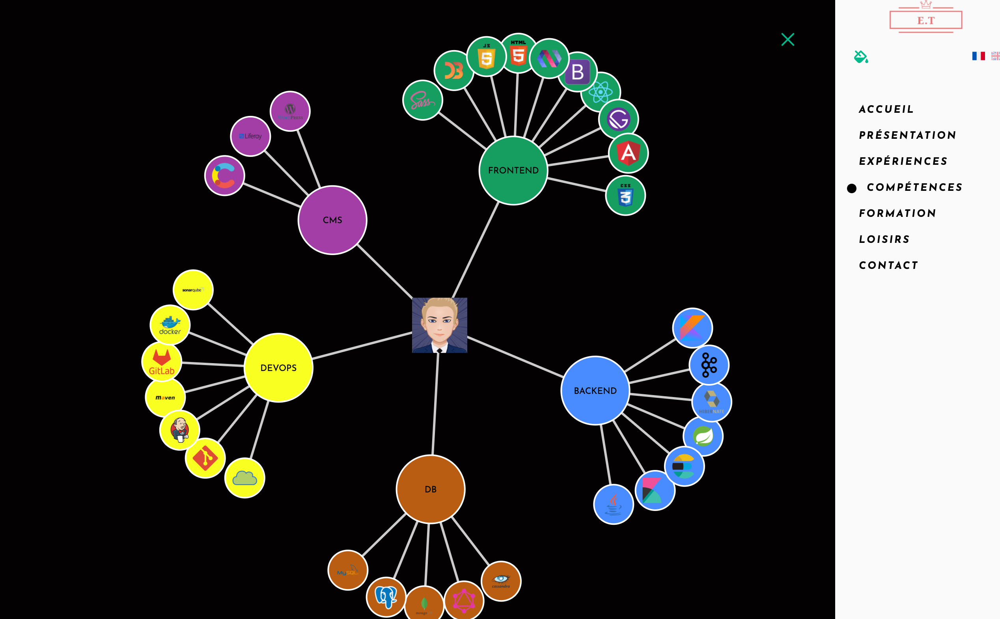

<!-- AUTO-GENERATED-CONTENT:START (STARTER) -->
<p align="center">
  <a href="https://www.gatsbyjs.org">
    
  </a>
</p>
<h1 align="center">
  My Online Resume
</h1>

My resume built using Gatsby JS and Contenful.


## 🚀 Démo

https://www.emmanuel-tarrou.com/

## 🚀 Quick start

1.  **Start developing.**

    Navigate into your new site’s directory and start it up.

    ```shell
    cd gatsby-my-portfolio/
    gatsby develop
    ```

1.  **Open the source code and start editing!**

        Your site is now running at `http://localhost:8000`!

      <a href="https://www.gatsbyjs.org">
        
      </a>
    </p>
